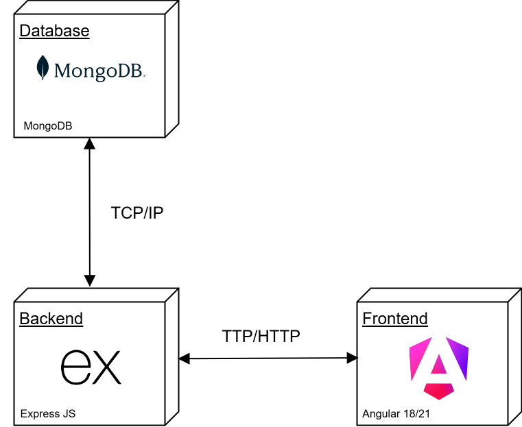

# SweetOnion

A specialized web application for chat generation designed for **conversational topics**. The platform leverages **Speech-to-Text (STT)** and **Text-to-Speech (TTS)** technologies to provide an immersive, hands-free interaction experience.

---

<p align="center">
  
</p>

<p align="center">
  <a href="https://albinjunliang.github.io/sweet-onion/" target="_blank">
    
  </a>
</p>

## Key Features

- **Real-time Transcription:** Uses the Web Speech API for seamless Voice-to-Text input.
- **Voice Synthesis:** Integrated Text-to-Speech to reproduce AI responses audibly.
- **Voice Toggle:** Interactive control to enable or disable audio playback at any time.
- **User can sign up and sign in:** With google or with user and password.

---

## Functional Requirements

### 1. General System Rules

- **Rate Limiting:** To optimize resources, the system limits message generation to **10 prompts per hour** for standard sessions.
- **Multimodal Input:** Support for both keyboard text input and voice commands.

### 2. User Roles & Permissions

#### **A. Guest (Unregistered User)**

- Subject to the standard rate limit (10 prompts per hour).
- No data persistence (sessions are lost upon closing the browser).

#### **B. Registered User**

- **Data Persistence:** Ability to save conversation history to a personal dashboard.
- **Session Management:** Can manually restart a chat to begin a new scenario or delete existing records.
- **Progress Tracking:** Access to stored feedback from previous interviews.

#### **C. Administrative User (Admin)**

- **Unlimited Access:** Bypasses the hourly rate limit (unlimited prompts).
- **System Oversight:** High-level access to application management (optional/expandable).

---

## 🛠 Tech Stack

- **Frontend:** Angular.
- **Backend:** NodeJS | Express JS.
- **Database:** MongoDB.

---

<p align="center">
  
</p>

## Backend environments configuration

#### .ENV File

```yaml
MONGO_URI="mongoDbConnectionString"
NODE_ENV=production
OPENROUTER_API_KEY=""
GROQ_API_KEY=""
GOOGLE_AI_API_KEY=""
NVIDIA_API_KEY=""
HUGGINGFACE_API_KEY=""
CEREBRAS_API_KEY=""
ADMIN_EMAILS=helloworld@mail.com
FIREBASE_SERVICE_ACCOUNT="{json: account}"
```

## Frontend environments configuration

### environment.ts file

```js
export const environment = {
  production: false,
  mockeable: false,
  apiUrl: "localhost:5000/api",
  firebaseConfig: {
    apiKey: "Azk",
    authDomain: "",
    projectId: "cebolla-dulce",
    storageBucket: "",
    messagingSenderId: "",
    appId: "",
    measurementId: "",
  },
};
```
