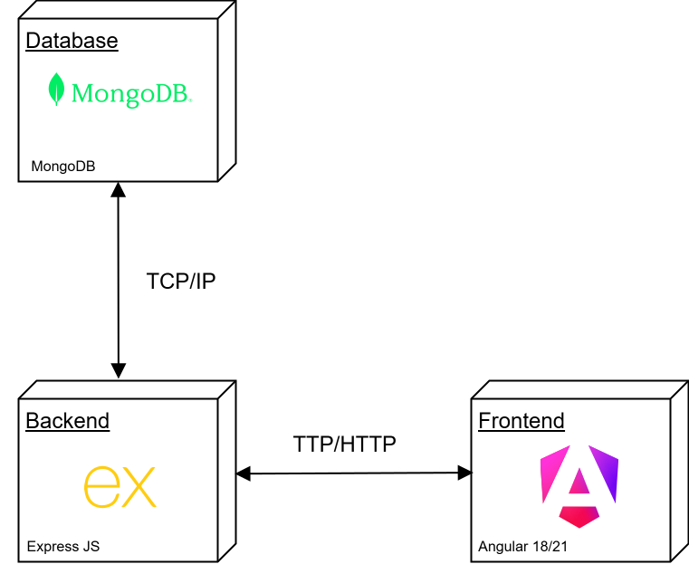

# SweetOnion

A specialized web application for AI-powered chat generation focused on **conversational topics**. The platform leverages **Speech-to-Text (STT)** and **Text-to-Speech (TTS)** technologies to provide an immersive, hands-free interaction experience.

---

<p align="center">
  
</p>

<p align="center">
  <a href="https://albinjunliang.github.io/sweet-onion/" target="_blank">
    
  </a>
</p>

## Table of Contents

* [Key Features](#key-features)
* [Functional Requirements](#functional-requirements)

  * [General System Rules](#1-general-system-rules)
  * [User Roles & Permissions](#2-user-roles--permissions)
* [Additional URLs](#additional-urls)
* [Tech Stack](#-tech-stack)
* [System Architecture](#system-architecture)
* [Endpoints and Technical Documentation](#endpoints-and-technical-documentation)
* [Backend Environment and Configuration](#backend-environment-and-configuration)
* [Frontend Environment and Configuration](#frontend-environment-and-configuration)

---

## Key Features

* **Real-Time Transcription:** Uses the Web Speech API for seamless voice-to-text input.
* **Voice Synthesis:** Integrated Text-to-Speech functionality to reproduce AI responses audibly.
* **Voice Toggle:** Interactive control to enable or disable audio playback at any time.
* **Authentication:** Users can sign up and sign in using Google or email and password.

---

## Functional Requirements

### 1. General System Rules

* **Rate Limiting:** To optimize resource consumption, the system limits message generation to **10 prompts per hour** for standard sessions.
* **Multimodal Input:** Supports both keyboard text input and voice commands.

### 2. User Roles & Permissions

#### A. Guest (Unregistered User)

* Subject to the standard rate limit (10 prompts per hour).
* No data persistence; sessions are lost when the browser is closed.

#### B. Registered User

* **Data Persistence:** Ability to save conversation history to a personal dashboard.
* **Session Management:** Can manually restart a chat to begin a new conversation or delete existing records.
* **Progress Tracking:** Access to stored feedback from previous interviews.

#### C. Administrative User (Admin)

* **Unlimited Access:** Bypasses the hourly rate limit.
* **System Oversight:** High-level access to application management (optional and expandable).

---

## Additional URLs

### Set a Default Model from the URL

Allows a default model to be selected through URL parameters by providing the model identifier.

```text
https://albinjunliang.github.io/sweet-onion/chat?model=6a250b947217d970d9d175f9
```

### Open a Chat from the URL

Currently, this feature only works for chats that belong to the authenticated user. If the chat is not available or does not belong to the user, the application displays an error notification.

The chat is opened using its unique identifier.

```text
https://albinjunliang.github.io/sweet-onion/chat/6a250ba27217d970d9d175fa
```

---

## 🛠 Tech Stack

* **Frontend:** Angular
* **Backend:** Node.js | Express.js
* **Database:** MongoDB

---

## System Architecture

<p align="center">
  
</p>

---

## Endpoints and Technical Documentation

### Start an Interview

This endpoint initiates an interview and returns a JSON schema containing the interview context and the first question.

Internally, both the generated context and the first question are stored. These values are later used by the AI to generate subsequent questions while maintaining consistency throughout the interview.

**Endpoint**

```text
/completions/interview/${body.provider}/init
```

<p align="center">
  
</p>

### Evaluate an Answer

Receives the user's answer and evaluates it based on the interview context generated during interview initialization.

The endpoint returns:

* Feedback about the submitted answer.
* A new question related to the same interview topic.

**Endpoint**

```text
/completions/interview/${body.provider}/evaluate
```

### Temporary Conversation

Starts a temporary conversation that does not require authentication or data persistence.

The endpoint sends the user's prompt together with the last two messages of the conversation to provide context for the next AI response.

**Endpoint**

```text
/completions/temp/${body.provider}
```

### Initialize a Persistent Conversation

Creates a new persistent chat session. Authentication is required.

When the prompt is received, the system automatically generates a conversation title, stores the chat in the database, and returns the AI response to the client.

**Endpoint**

```text
/completions/chat/${body.provider}/init
```

### Continue a Persistent Conversation

Maintains an existing persistent conversation and generates a new AI response.

As with temporary conversations, the AI uses the last two messages as context. However, in this case, the context is retrieved internally from the database because the endpoint only receives the chat identifier in the request body.

**Endpoint**

```text
/completions/chat/${body.provider}
```

---

## Backend Environment and Configuration

### .env File

```yaml
MONGO_URI="mongoDbConnectionString"
NODE_ENV=production
OPENROUTER_API_KEY=""
GROQ_API_KEY=""
GOOGLE_AI_API_KEY=""
NVIDIA_API_KEY=""
HUGGINGFACE_API_KEY=""
CEREBRAS_API_KEY=""
ADMIN_EMAILS=helloworld@mail.com
FIREBASE_SERVICE_ACCOUNT="{json: account}"
```

### Dependency Installation

```shell
npm install
```

### Run Scripts

```shell
npm run dev   # Development

npm start     # Production
```

---

## Frontend Environment and Configuration

### environment.ts File

```ts
export const environment = {
  production: false,
  mockeable: false,
  apiUrl: "localhost:5000/api",
  firebaseConfig: {
    apiKey: "Azk",
    authDomain: "",
    projectId: "cebolla-dulce",
    storageBucket: "",
    messagingSenderId: "",
    appId: "",
    measurementId: "",
  },
};
```

### Dependency Installation

```shell
npm install
```

### Run Scripts

```shell
ng serve   # Development

ng build   # Production
```
